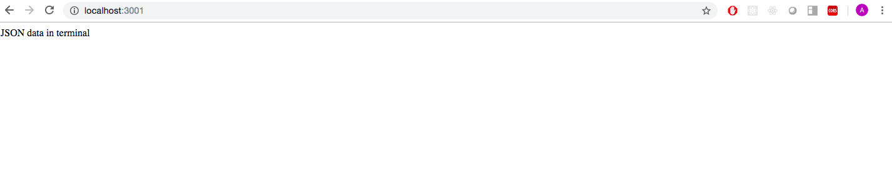

# CSV to JSON

## Objectives

- To create a node server.
- To build a node script to convert CSV files to JSON files.

## Description

Write a node script that will convert the 'customer-data.csv' file into a JSON file. The 1st row of the CSV file acts as the keys/properties of the JSON object and the rest of the fields act as values. The JSON file must have an array with 1000 items.

JSON structure:

```
[
  {
    "id": "1",
    "first_name": "Ario",
    "last_name": "Noteyoung",
    "email": "anoteyoung0@nhs.uk",
    "gender": "Male",
    "ip_address": "99.5.160.227",
    "ssn": "509-86-9654",
    "credit_card": "5602256742685208",
    "bitcoin": "179BsXQkUuC6NKYNsQkdmKQKbMBPmJtEHB",
    "street_address": "0227 Kropf Court"
  },
  {
    "id": "2",
    "first_name": "Minni",
    "last_name": "Endon",
    "email": "mendon1@netvibes.com",
    "gender": "Female",
    "ip_address": "213.62.229.103",
    "ssn": "765-11-9543",
    "credit_card": "67613037902735554",
    "bitcoin": "135wbMcR98R6hqqWgEJXHZHcanQKGRPwE1",
    "street_address": "90 Sutteridge Way"
  },
  ...
```

## Sprints

1) Create project folder for this project.
2) Create a server node on port 3001.
3) Convert the csv file `customer-data.csv` to json.
4) Read the JSON file.
5) Show id's in terminal.
6) Launch script.

## Deliverables

- When you run 'app.js' and load browser…



You'll have in terminal…

```
$ node app.js
Converting to JSON...
1
2
3
4
…
1000
```


